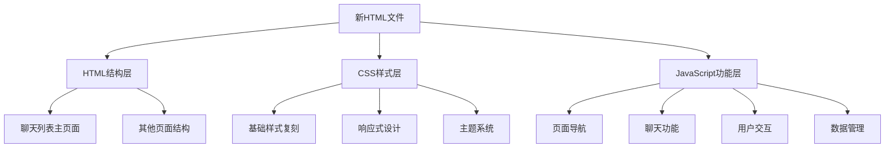

# 聊天应用复刻项目设计文档

## 概述

本设计文档基于对V0.03_phone.html源文件的深入分析，制定了一个分阶段的复刻策略。项目将创建一个全新的单页HTML文件，完全复刻源文件的聊天列表主页面，然后逐步添加功能和其他页面。

## 架构

### 整体架构设计



### 分层架构

1. **表现层 (Presentation Layer)**
   - HTML结构定义
   - CSS样式系统
   - 响应式布局

2. **交互层 (Interaction Layer)**
   - 事件处理
   - 用户界面交互
   - 页面导航控制

3. **业务逻辑层 (Business Logic Layer)**
   - 聊天功能实现
   - 数据处理逻辑
   - 状态管理

4. **数据层 (Data Layer)**
   - 本地存储管理
   - 数据结构定义
   - 数据持久化

## 组件和接口

### 核心组件设计

#### 1. 页面容器组件 (PageContainer)

**职责：** 管理整个应用的页面结构和导航

**接口：**
```javascript
class PageContainer {
    constructor()
    showScreen(screenId)
    hideScreen(screenId)
    getCurrentScreen()
    initializeScreens()
}
```

**HTML结构：**
```html
<div id="phone-screen">
    <div id="chat-list-screen" class="screen active">
        <!-- 聊天列表主页面 -->
    </div>
    <div id="chat-interface-screen" class="screen">
        <!-- 聊天对话页面 -->
    </div>
    <!-- 其他页面... -->
</div>
```

#### 2. 聊天列表组件 (ChatListComponent)

**职责：** 管理聊天列表的显示和交互

**接口：**
```javascript
class ChatListComponent {
    constructor()
    renderChatList()
    createChatListItem(chat)
    filterChats(type) // 'all', 'single', 'group'
    handleChatClick(chatId)
}
```

**HTML结构：**
```html
<div id="chat-list-screen" class="screen active">
    <!-- 头部区域 -->
    <div class="header" id="main-chat-list-header">
        <!-- 用户头像 -->
        <div class="user-avatar-container">
            
            <div class="user-dropdown-menu" id="user-dropdown-menu">
                <!-- 下拉菜单项 -->
            </div>
        </div>
        
        <!-- 群聊/单聊切换开关 -->
        <div class="chat-type-toggle" id="chat-type-toggle">
            <button class="toggle-btn active" data-type="all">全部</button>
            <button class="toggle-btn" data-type="single">单聊</button>
            <button class="toggle-btn" data-type="group">群聊</button>
        </div>
        
        <!-- 添加按钮 -->
        <div class="header-actions">
            <div class="add-menu-container">
                <span class="action-btn" id="add-menu-btn">+</span>
                <div class="add-dropdown-menu" id="add-dropdown-menu">
                    <!-- 添加好友/群聊选项 -->
                </div>
            </div>
        </div>
    </div>
    
    <!-- 消息列表视图 -->
    <div id="messages-view" class="chat-list-view active">
        <div class="chat-list-bg-layer" id="chat-list-bg-layer"></div>
        <div id="chat-list">
            <!-- 动态生成的聊天列表项 -->
        </div>
    </div>
    
    <!-- 底部导航栏 -->
    <div id="chat-list-bottom-nav">
        <div class="nav-item active" data-view="messages-view">
            <span>消息</span>
        </div>
        <div class="nav-item" data-view="qzone-screen">
            <span>动态</span>
        </div>
        <div class="nav-item" data-view="call-history-screen">
            <span>聊天历史</span>
        </div>
    </div>
</div>
```

#### 3. 头部组件 (HeaderComponent)

**职责：** 管理页面头部的用户交互元素

**接口：**
```javascript
class HeaderComponent {
    constructor()
    initializeUserAvatar()
    initializeChatTypeToggle()
    initializeAddMenu()
    handleUserAvatarClick()
    handleChatTypeToggle(type)
    handleAddMenuClick()
}
```

#### 4. 导航组件 (NavigationComponent)

**职责：** 管理底部导航栏的页面切换

**接口：**
```javascript
class NavigationComponent {
    constructor()
    initializeNavigation()
    switchView(viewId)
    updateActiveNavItem(viewId)
}
```

### 数据模型

#### 聊天数据模型
```javascript
const ChatModel = {
    id: String,           // 聊天ID
    name: String,         // 聊天名称
    isGroup: Boolean,     // 是否为群聊
    avatar: String,       // 头像URL
    lastMessage: String,  // 最后一条消息
    timestamp: Number,    // 最后消息时间戳
    unreadCount: Number,  // 未读消息数
    settings: Object,     // 聊天设置
    history: Array        // 消息历史
}
```

#### 用户数据模型
```javascript
const UserModel = {
    id: String,
    name: String,
    avatar: String,
    settings: Object
}
```

## 错误处理

### 错误处理策略

1. **页面加载错误**
   - 检查必要的DOM元素是否存在
   - 提供默认值和回退机制
   - 显示用户友好的错误信息

2. **数据处理错误**
   - 验证数据格式和完整性
   - 处理空数据和异常数据
   - 提供数据恢复机制

3. **用户交互错误**
   - 验证用户输入
   - 防止重复操作
   - 提供操作反馈

### 错误处理实现

```javascript
class ErrorHandler {
    static handlePageLoadError(error) {
        console.error('页面加载错误:', error);
        // 显示错误提示
        // 尝试恢复或重新加载
    }
    
    static handleDataError(error, context) {
        console.error('数据处理错误:', error, context);
        // 数据验证和修复
        // 提供默认数据
    }
    
    static handleUserInteractionError(error, action) {
        console.error('用户交互错误:', error, action);
        // 显示用户友好的错误信息
        // 重置界面状态
    }
}
```

## 测试策略

### 测试层级

1. **单元测试**
   - 测试各个组件的独立功能
   - 验证数据模型的正确性
   - 测试工具函数

2. **集成测试**
   - 测试组件间的交互
   - 验证页面导航功能
   - 测试数据流

3. **端到端测试**
   - 测试完整的用户流程
   - 验证界面响应性
   - 测试跨浏览器兼容性

### 测试用例设计

```javascript
// 示例测试用例
describe('ChatListComponent', () => {
    test('应该正确渲染聊天列表', () => {
        // 测试聊天列表渲染
    });
    
    test('应该正确过滤聊天类型', () => {
        // 测试聊天类型过滤
    });
    
    test('应该正确处理聊天点击事件', () => {
        // 测试聊天点击处理
    });
});
```

## 实现阶段设计

### 阶段1：主页面复刻

**目标：** 100%复刻聊天列表主页面的视觉效果

**实现步骤：**
1. 创建基础HTML结构
2. 复制并适配CSS样式
3. 实现静态页面展示
4. 验证视觉一致性

**关键技术点：**
- CSS Grid/Flexbox布局
- 响应式设计
- 字体和颜色系统
- 图标和图片处理

### 阶段2：功能分析和记录

**目标：** 识别并记录所有交互元素和功能

**实现步骤：**
1. 分析头部交互元素
2. 分析聊天列表交互
3. 分析底部导航功能
4. 记录页面跳转关系
5. 定位源代码位置

**输出文档：**
- 功能按键映射表
- 页面跳转流程图
- 源代码位置索引

### 阶段3：JavaScript功能实现

**目标：** 为主页面添加完整的交互功能

**实现步骤：**
1. 实现页面导航系统
2. 实现聊天列表管理
3. 实现用户交互功能
4. 实现数据存储系统
5. 集成所有功能模块

**关键功能：**
- 聊天类型切换
- 用户头像下拉菜单
- 添加好友/群聊
- 底部导航切换
- 聊天列表渲染

### 阶段4：其他页面添加

**目标：** 根据功能分析结果，逐步添加其他页面

**页面优先级：**
1. 聊天对话页面
2. API设置页面
3. 外观设置页面
4. 世界书页面
5. 动态页面
6. 其他辅助页面

## 性能优化

### 优化策略

1. **DOM操作优化**
   - 减少DOM查询次数
   - 使用文档片段批量操作
   - 避免频繁的样式重计算

2. **内存管理**
   - 及时清理事件监听器
   - 避免内存泄漏
   - 优化数据结构

3. **加载性能**
   - 延迟加载非关键资源
   - 压缩CSS和JavaScript
   - 优化图片资源

### 性能监控

```javascript
class PerformanceMonitor {
    static measureRenderTime(componentName, renderFunction) {
        const startTime = performance.now();
        renderFunction();
        const endTime = performance.now();
        console.log(`${componentName} 渲染时间: ${endTime - startTime}ms`);
    }
    
    static monitorMemoryUsage() {
        if (performance.memory) {
            console.log('内存使用情况:', performance.memory);
        }
    }
}
```

## 安全考虑

### 安全措施

1. **输入验证**
   - 验证用户输入数据
   - 防止XSS攻击
   - 过滤恶意内容

2. **数据安全**
   - 加密敏感数据
   - 安全的数据存储
   - 防止数据泄露

3. **代码安全**
   - 避免使用eval()
   - 安全的DOM操作
   - 防止代码注入

## 维护性设计

### 代码组织

1. **模块化设计**
   - 功能模块分离
   - 清晰的接口定义
   - 低耦合高内聚

2. **代码规范**
   - 统一的命名规范
   - 详细的注释说明
   - 一致的代码风格

3. **文档维护**
   - API文档
   - 使用说明
   - 更新日志

### 扩展性考虑

1. **插件系统**
   - 支持功能扩展
   - 主题系统
   - 配置系统

2. **版本管理**
   - 向后兼容性
   - 数据迁移
   - 功能开关

## 技术栈选择

### 核心技术

- **HTML5**: 语义化标记和现代Web API
- **CSS3**: 现代布局和动画效果
- **Vanilla JavaScript**: 原生JavaScript实现，无外部依赖
- **IndexedDB**: 客户端数据存储（如需要）
- **Web APIs**: 文件处理、通知等现代浏览器API

### 工具和库

- **开发工具**: VS Code, Chrome DevTools
- **测试工具**: Jest (如需要)
- **构建工具**: 无需构建工具，直接运行
- **版本控制**: Git

## 浏览器兼容性

### 目标浏览器

- Chrome 80+
- Firefox 75+
- Safari 13+
- Edge 80+

### 兼容性策略

1. **渐进增强**
   - 基础功能优先
   - 现代特性作为增强

2. **特性检测**
   - 检测浏览器支持
   - 提供回退方案

3. **Polyfill使用**
   - 必要时使用Polyfill
   - 保持代码简洁