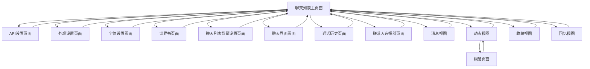
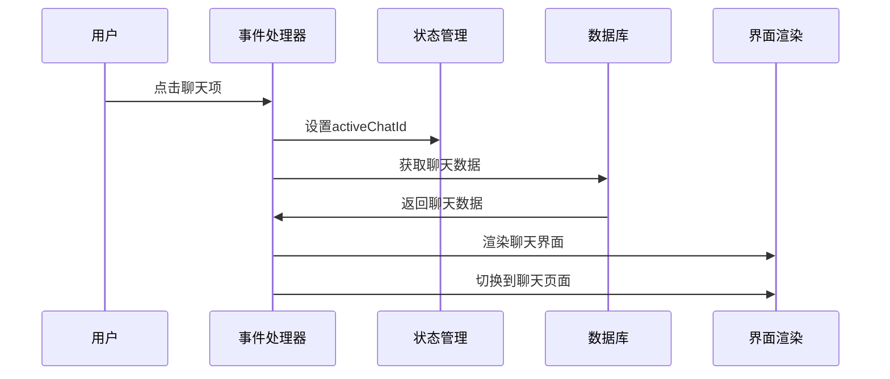
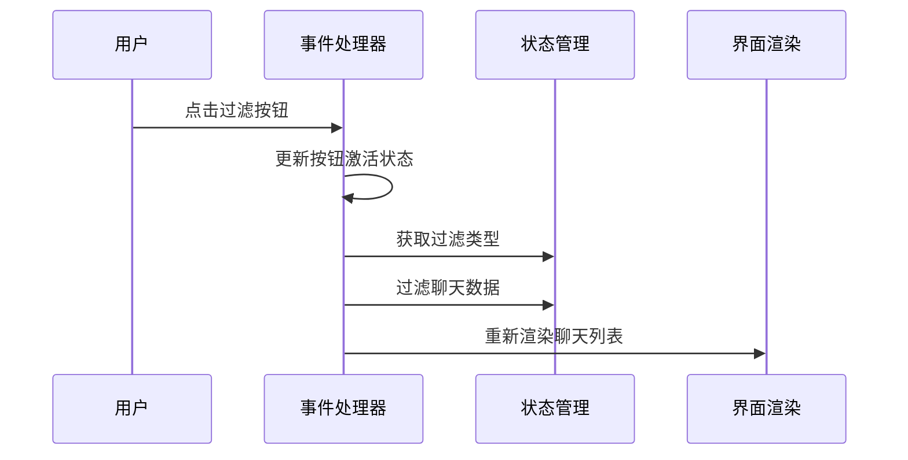

# 聊天应用功能映射文档

## 概述
本文档整合了聊天列表页面的所有交互功能分析，提供功能按键与源代码位置的完整对应表，以及页面导航关系和实现优先级。

## 1. 功能按键与源代码映射表

### 1.1 头部交互元素

| 功能按键 | 元素ID | 交互类型 | 目标页面/功能 | 源代码位置 | JavaScript函数 |
|---------|--------|----------|---------------|------------|----------------|
| 用户头像 | `#user-avatar` | 点击 | 显示/隐藏下拉菜单 | 需查找 | 切换`.visible`类 |
| API设置 | `#dropdown-api-settings` | 点击 | `api-settings-screen` | V0.03_phone.html:13007 | `showScreen('api-settings-screen')` |
| 外观设置 | `#dropdown-appearance-settings` | 点击 | `wallpaper-screen` | V0.03_phone.html:13012 | `showScreen('wallpaper-screen')` |
| 字体设置 | `#dropdown-font-settings` | 点击 | `font-settings-screen` | V0.03_phone.html:13017 | `showScreen('font-settings-screen')` |
| 世界书 | `#dropdown-world-book` | 点击 | `world-book-screen` | V0.03_phone.html:13022 | `showScreen('world-book-screen')` |
| 回忆 | `#dropdown-memories` | 点击 | `memories-view` | V0.03_phone.html:14730 | `switchToChatListView('memories-view')` |
| 收藏 | `#dropdown-favorites` | 点击 | `favorites-view` | V0.03_phone.html:14743 | `switchToChatListView('favorites-view')` |
| 更换头像 | `#dropdown-change-avatar` | 点击 | 文件选择器 | V0.03_phone.html:13027 | `document.getElementById('user-avatar-upload-input').click()` |
| 聊天背景 | `#dropdown-chat-list-bg` | 点击 | `chat-list-bg-screen` | V0.03_phone.html:13032 | `showScreen('chat-list-bg-screen')` |
| 全部切换 | `#toggle-all` | 点击 | 显示所有聊天 | V0.03_phone.html:15072 | `renderChatList()` |
| 单聊切换 | `#toggle-single` | 点击 | 只显示单聊 | V0.03_phone.html:15072 | `renderChatList()` |
| 群聊切换 | `#toggle-group` | 点击 | 只显示群聊 | V0.03_phone.html:15072 | `renderChatList()` |
| 切换开关 | `#chat-type-toggle` | 双击 | 通话历史页面 | V0.03_phone.html:15084 | `renderCallHistoryScreen()` |
| 添加按钮 | `#add-menu-btn` | 点击 | 显示/隐藏添加菜单 | 需实现 | 切换`.visible`类 |
| 添加好友 | `#add-friend-btn` | 点击 | 添加好友对话框 | V0.03_phone.html:12950 | `showCustomPrompt()` + 创建聊天 |
| 创建群聊 | `#add-group-chat-btn` | 点击 | 联系人选择器 | 需查找 | `openContactPickerForGroupCreate()` |

### 1.2 聊天列表交互元素

| 功能按键 | 元素选择器 | 交互类型 | 目标页面/功能 | 源代码位置 | JavaScript函数 |
|---------|------------|----------|---------------|------------|----------------|
| 聊天项信息 | `.chat-list-item .info` | 点击 | 进入聊天界面 | V0.03_phone.html:7558 | `openChat(chat.id)` |
| 聊天项 | `.chat-list-item` | 长按 | 删除聊天确认 | V0.03_phone.html:7561 | `showCustomConfirm()` + 删除逻辑 |
| 聊天头像 | `.chat-list-item .avatar` | 点击 | 拍一拍功能 | 需查找 | 发送拍一拍消息 |

### 1.3 底部导航元素

| 功能按键 | 元素选择器 | 交互类型 | 目标页面/功能 | 源代码位置 | JavaScript函数 |
|---------|------------|----------|---------------|------------|----------------|
| 消息导航 | `[data-view="messages-view"]` | 点击 | 消息列表视图 | V0.03_phone.html:13651 | `switchToChatListView('messages-view')` |
| 动态导航 | `[data-view="qzone-screen"]` | 点击 | 动态视图 | V0.03_phone.html:13651 | `switchToChatListView('qzone-screen')` |
| 聊天历史导航 | `[data-view="call-history-screen"]` | 点击 | 通话历史页面 | V0.03_phone.html:13651 | `renderCallHistoryScreen()` |

## 2. 页面导航关系图



## 3. 核心JavaScript函数依赖

### 3.1 页面管理函数

| 函数名 | 功能描述 | 参数 | 返回值 | 源代码位置 |
|--------|----------|------|--------|------------|
| `showScreen(screenId)` | 切换到指定页面 | screenId: string | void | V0.03_phone.html:6388 |
| `switchToChatListView(viewId)` | 在聊天列表页面内切换视图 | viewId: string | void | V0.03_phone.html:6406 |

### 3.2 聊天管理函数

| 函数名 | 功能描述 | 参数 | 返回值 | 源代码位置 |
|--------|----------|------|--------|------------|
| `renderChatList()` | 重新渲染聊天列表 | 无 | Promise<void> | V0.03_phone.html:7372 |
| `openChat(chatId)` | 打开指定聊天 | chatId: string | Promise<void> | V0.03_phone.html:8173 |
| `createChatListItem(chat)` | 创建聊天列表项 | chat: Object | HTMLElement | 内嵌在renderChatList中 |

### 3.3 UI交互函数

| 函数名 | 功能描述 | 参数 | 返回值 | 源代码位置 |
|--------|----------|------|--------|------------|
| `showCustomPrompt(title, message)` | 显示自定义输入对话框 | title: string, message: string | Promise<string> | 需查找 |
| `showCustomConfirm(title, message, options)` | 显示自定义确认对话框 | title: string, message: string, options: Object | Promise<boolean> | 需查找 |
| `addLongPressListener(element, callback)` | 添加长按监听器 | element: HTMLElement, callback: Function | void | V0.03_phone.html:9341 |

### 3.4 视图渲染函数

| 函数名 | 功能描述 | 参数 | 返回值 | 源代码位置 |
|--------|----------|------|--------|------------|
| `renderQzoneScreen()` | 渲染动态页面 | 无 | void | V0.03_phone.html:6467 |
| `renderFavoritesScreen()` | 渲染收藏页面 | 无 | Promise<void> | V0.03_phone.html:6911 |
| `renderMemoriesScreen()` | 渲染回忆页面 | 无 | Promise<void> | V0.03_phone.html:11520 |
| `renderCallHistoryScreen()` | 渲染通话历史页面 | 无 | Promise<void> | V0.03_phone.html:12729 |

## 4. 数据结构和状态管理

### 4.1 全局状态对象
```javascript
const state = {
    chats: {},              // 所有聊天数据
    activeChatId: null,     // 当前活跃聊天ID
    globalSettings: {},     // 全局设置
    qzoneSettings: {},      // 动态页面设置
    worldBooks: []          // 世界书数据
};
```

### 4.2 聊天数据模型
```javascript
const chatModel = {
    id: String,             // 聊天唯一标识
    name: String,           // 聊天名称
    isGroup: Boolean,       // 是否为群聊
    history: Array,         // 消息历史
    settings: {
        aiPersona: String,
        myPersona: String,
        aiAvatar: String,
        myAvatar: String,
        background: String,
        theme: String,
        fontSize: Number,
        customCss: String,
        linkedWorldBookIds: Array
    },
    status: {               // 单聊状态
        text: String,
        lastUpdate: Number,
        isBusy: Boolean
    },
    members: Array,         // 群聊成员
    musicData: Object       // 音乐数据
};
```

### 4.3 数据库表结构
- `chats`: 聊天数据表
- `favorites`: 收藏消息表
- `memories`: 回忆记录表
- `worldBooks`: 世界书表

## 5. 事件处理流程

### 5.1 聊天项点击流程


### 5.2 聊天过滤流程


## 6. 实现优先级矩阵

### 6.1 高优先级（核心功能）
| 功能 | 复杂度 | 重要性 | 实现顺序 |
|------|--------|--------|----------|
| 页面导航系统 | 中 | 高 | 1 |
| 聊天列表渲染 | 中 | 高 | 2 |
| 聊天项点击进入 | 低 | 高 | 3 |
| 群聊/单聊过滤 | 低 | 高 | 4 |
| 用户头像菜单 | 中 | 高 | 5 |

### 6.2 中优先级（增强功能）
| 功能 | 复杂度 | 重要性 | 实现顺序 |
|------|--------|--------|----------|
| 添加好友功能 | 中 | 中 | 6 |
| 聊天项长按删除 | 中 | 中 | 7 |
| 底部导航切换 | 低 | 中 | 8 |
| 设置页面跳转 | 低 | 中 | 9 |
| 通话历史功能 | 中 | 中 | 10 |

### 6.3 低优先级（高级功能）
| 功能 | 复杂度 | 重要性 | 实现顺序 |
|------|--------|--------|----------|
| 创建群聊功能 | 高 | 低 | 11 |
| 动态视图功能 | 高 | 低 | 12 |
| 收藏功能 | 中 | 低 | 13 |
| 回忆功能 | 中 | 低 | 14 |
| 更换头像功能 | 中 | 低 | 15 |

## 7. 技术实现要点

### 7.1 事件委托
- 使用事件委托处理动态生成的聊天列表项
- 减少事件监听器数量，提高性能

### 7.2 状态同步
- 确保UI状态与数据状态保持一致
- 实现响应式数据更新

### 7.3 错误处理
- 添加异常捕获和用户友好的错误提示
- 实现优雅降级

### 7.4 性能优化
- 使用虚拟滚动处理大量聊天列表
- 实现懒加载和按需渲染

## 8. 开发阶段规划

### 8.1 阶段1：基础框架（任务18-23）
- 实现页面导航系统
- 创建基础的聊天列表渲染
- 实现简单的用户交互

### 8.2 阶段2：核心功能（任务24-27）
- 实现聊天界面
- 添加聊天功能
- 完善用户交互

### 8.3 阶段3：设置页面（任务28-30）
- 实现各种设置页面
- 添加配置功能
- 完善用户体验

### 8.4 阶段4：高级功能（任务31-40）
- 实现动态和其他页面
- 添加数据存储
- 优化性能和用户体验

## 9. 测试策略

### 9.1 单元测试
- 测试各个功能函数
- 验证数据处理逻辑
- 检查边界条件

### 9.2 集成测试
- 测试页面导航流程
- 验证数据流完整性
- 检查用户交互流程

### 9.3 用户体验测试
- 测试响应时间
- 验证交互流畅性
- 检查错误处理

## 10. 维护和扩展

### 10.1 代码组织
- 模块化设计
- 清晰的接口定义
- 完善的文档注释

### 10.2 功能扩展
- 预留扩展接口
- 支持插件机制
- 配置化设计

### 10.3 版本管理
- 向后兼容性
- 数据迁移策略
- 功能开关控制