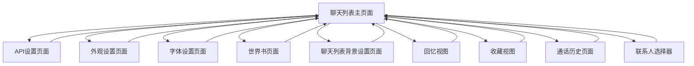

# 头部交互元素功能分析

## 概述
本文档分析聊天列表页面头部区域的所有交互元素，包括功能描述、目标页面和源代码位置。

## 1. 用户头像交互功能

### 1.1 用户头像点击
- **元素ID**: `#user-avatar`
- **交互类型**: 点击
- **功能**: 显示/隐藏用户下拉菜单
- **源代码位置**: V0.03_phone.html (需要查找具体行号)
- **实现逻辑**: 切换 `.user-dropdown-menu` 的 `visible` 类

### 1.2 用户下拉菜单项

#### 1.2.1 API设置
- **元素ID**: `#dropdown-api-settings`
- **交互类型**: 点击
- **功能**: 跳转到API设置页面
- **目标页面**: `api-settings-screen`
- **源代码位置**: V0.03_phone.html 第13007行
- **实现代码**:
```javascript
document.getElementById('dropdown-api-settings')?.addEventListener('click', () => {
    userDropdownMenu.classList.remove('visible');
    showScreen('api-settings-screen');
});
```

#### 1.2.2 外观设置
- **元素ID**: `#dropdown-appearance-settings`
- **交互类型**: 点击
- **功能**: 跳转到外观设置页面
- **目标页面**: `wallpaper-screen`
- **源代码位置**: V0.03_phone.html 第13012行
- **实现代码**:
```javascript
document.getElementById('dropdown-appearance-settings')?.addEventListener('click', () => {
    userDropdownMenu.classList.remove('visible');
    showScreen('wallpaper-screen');
});
```

#### 1.2.3 字体设置
- **元素ID**: `#dropdown-font-settings`
- **交互类型**: 点击
- **功能**: 跳转到字体设置页面
- **目标页面**: `font-settings-screen`
- **源代码位置**: V0.03_phone.html 第13017行
- **实现代码**:
```javascript
document.getElementById('dropdown-font-settings')?.addEventListener('click', () => {
    userDropdownMenu.classList.remove('visible');
    showScreen('font-settings-screen');
});
```

#### 1.2.4 世界书
- **元素ID**: `#dropdown-world-book`
- **交互类型**: 点击
- **功能**: 跳转到世界书页面
- **目标页面**: `world-book-screen`
- **源代码位置**: V0.03_phone.html 第13022行
- **实现代码**:
```javascript
document.getElementById('dropdown-world-book')?.addEventListener('click', () => {
    userDropdownMenu.classList.remove('visible');
    showScreen('world-book-screen');
});
```

#### 1.2.5 回忆
- **元素ID**: `#dropdown-memories`
- **交互类型**: 点击
- **功能**: 切换到回忆视图
- **目标视图**: `memories-view`
- **源代码位置**: V0.03_phone.html 第14730行
- **实现代码**:
```javascript
document.querySelector('#dropdown-memories').addEventListener('click', () => {
    // 关闭收藏页面的编辑模式
    if (isFavoritesSelectionMode) {
        // 处理逻辑
    }
    // 切换视图逻辑
});
```

#### 1.2.6 收藏
- **元素ID**: `#dropdown-favorites`
- **交互类型**: 点击
- **功能**: 切换到收藏视图
- **目标视图**: `favorites-view`
- **源代码位置**: V0.03_phone.html 第14743行
- **实现代码**:
```javascript
document.querySelector('#dropdown-favorites').addEventListener('click', () => {
    // 关闭收藏页面的编辑模式
    if (isFavoritesSelectionMode) {
        // 处理逻辑
    }
    // 切换视图逻辑
});
```

#### 1.2.7 更换头像
- **元素ID**: `#dropdown-change-avatar`
- **交互类型**: 点击
- **功能**: 触发文件选择器上传头像
- **目标操作**: 打开文件选择对话框
- **源代码位置**: V0.03_phone.html 第13027行
- **实现代码**:
```javascript
document.getElementById('dropdown-change-avatar')?.addEventListener('click', () => {
    userDropdownMenu.classList.remove('visible');
    document.getElementById('user-avatar-upload-input').click();
});
```

#### 1.2.8 聊天背景
- **元素ID**: `#dropdown-chat-list-bg`
- **交互类型**: 点击
- **功能**: 跳转到聊天列表背景设置页面
- **目标页面**: `chat-list-bg-screen`
- **源代码位置**: V0.03_phone.html 第13032行
- **实现代码**:
```javascript
document.getElementById('dropdown-chat-list-bg')?.addEventListener('click', () => {
    userDropdownMenu.classList.remove('visible');
    showScreen('chat-list-bg-screen');
});
```

## 2. 群聊/单聊切换开关

### 2.1 切换按钮点击
- **容器ID**: `#chat-type-toggle`
- **按钮类**: `.toggle-btn`
- **交互类型**: 点击
- **功能**: 切换聊天列表过滤类型
- **过滤类型**: 
  - `all` - 显示所有聊天
  - `single` - 只显示单聊
  - `group` - 只显示群聊
- **源代码位置**: V0.03_phone.html 第15072行
- **实现代码**:
```javascript
document.getElementById('chat-type-toggle').addEventListener('click', (e) => {
    if (e.target.classList.contains('toggle-btn')) {
        // 移除所有按钮的active类
        document.querySelectorAll('.toggle-btn').forEach(btn => btn.classList.remove('active'));
        // 为点击的按钮添加active类
        e.target.classList.add('active');
        // 根据选择的类型重新渲染聊天列表
        renderChatList();
    }
});
```

### 2.2 双击进入通话历史
- **容器ID**: `#chat-type-toggle`
- **交互类型**: 双击
- **功能**: 进入通话历史记录页面
- **目标功能**: `renderCallHistoryScreen`
- **源代码位置**: V0.03_phone.html 第15084行
- **实现代码**:
```javascript
document.getElementById('chat-type-toggle').addEventListener('dblclick', renderCallHistoryScreen);
```

## 3. 添加按钮功能

### 3.1 添加菜单按钮
- **元素ID**: `#add-menu-btn`
- **交互类型**: 点击
- **功能**: 显示/隐藏添加下拉菜单
- **实现逻辑**: 切换 `.add-dropdown-menu` 的 `visible` 类

### 3.2 添加好友
- **元素ID**: `#add-friend-btn`
- **交互类型**: 点击
- **功能**: 添加新的单聊好友
- **源代码位置**: V0.03_phone.html 第12950行
- **实现逻辑**:
  1. 显示输入对话框获取好友名称
  2. 创建新的单聊对象
  3. 保存到数据库
  4. 刷新聊天列表
- **实现代码**:
```javascript
document.getElementById('add-friend-btn').addEventListener('click', async () => {
    const name = await showCustomPrompt('添加好友', '请输入Ta的名字');
    if (name && name.trim()) {
        const newChatId = 'chat_' + Date.now();
        const newChat = {
            id: newChatId,
            name: name.trim(),
            isGroup: false,
            // ... 其他属性
        };
        state.chats[newChatId] = newChat;
        await db.chats.put(newChat);
        renderChatList();
    }
});
```

### 3.3 创建群聊
- **元素ID**: `#add-group-chat-btn`
- **交互类型**: 点击
- **功能**: 创建新的群聊
- **实现逻辑**:
  1. 打开联系人选择器
  2. 选择群聊成员
  3. 设置群聊名称
  4. 创建群聊对象
  5. 保存到数据库
- **相关函数**: `openContactPickerForGroupCreate`

## 4. 页面跳转关系图



## 5. 关键函数依赖

### 5.1 页面切换函数
- **函数名**: `showScreen(screenId)`
- **功能**: 切换到指定页面
- **参数**: 页面ID字符串

### 5.2 聊天列表渲染函数
- **函数名**: `renderChatList()`
- **功能**: 重新渲染聊天列表
- **触发条件**: 过滤类型改变、新增聊天等

### 5.3 自定义提示框函数
- **函数名**: `showCustomPrompt(title, message)`
- **功能**: 显示自定义输入对话框
- **返回值**: Promise<string>

### 5.4 通话历史渲染函数
- **函数名**: `renderCallHistoryScreen()`
- **功能**: 渲染通话历史记录页面

## 6. 数据结构依赖

### 6.1 全局状态对象
- **对象名**: `state`
- **包含属性**: 
  - `chats`: 所有聊天数据
  - `activeChatId`: 当前活跃聊天ID
  - `globalSettings`: 全局设置

### 6.2 数据库对象
- **对象名**: `db`
- **表结构**:
  - `chats`: 聊天数据表
  - 其他相关表

## 7. 实现优先级

### 高优先级（核心功能）
1. 用户头像点击显示/隐藏菜单
2. 群聊/单聊切换过滤
3. 添加好友功能
4. 页面跳转功能

### 中优先级（设置功能）
1. API设置页面跳转
2. 外观设置页面跳转
3. 字体设置页面跳转
4. 世界书页面跳转

### 低优先级（高级功能）
1. 更换头像功能
2. 聊天背景设置
3. 回忆和收藏视图
4. 通话历史功能

## 8. 注意事项

1. **菜单关闭逻辑**: 所有下拉菜单项点击后都需要关闭菜单
2. **状态管理**: 切换过滤类型时需要更新按钮激活状态
3. **数据持久化**: 新增聊天后需要保存到数据库
4. **错误处理**: 需要处理用户输入验证和异常情况
5. **响应式设计**: 确保在不同屏幕尺寸下正常工作